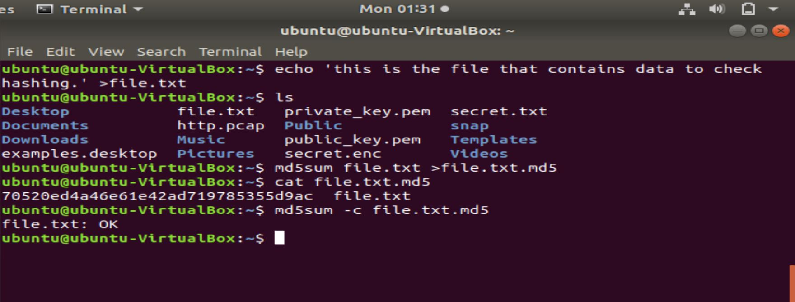
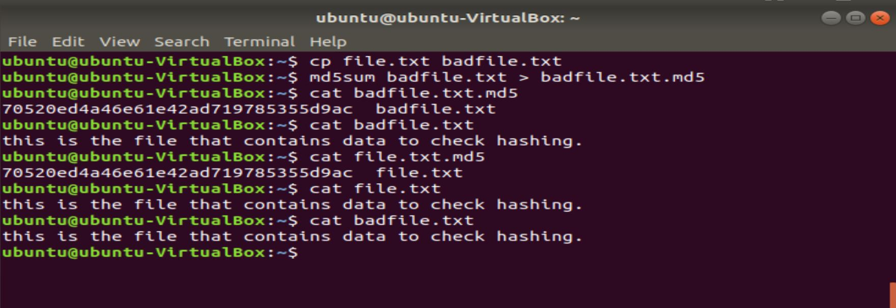
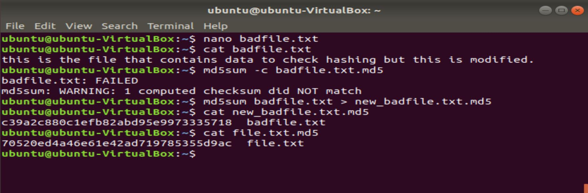
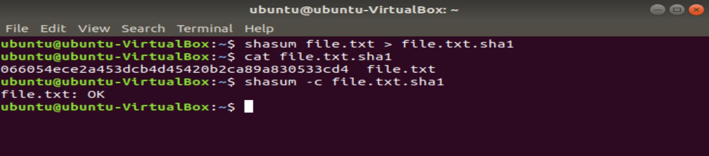
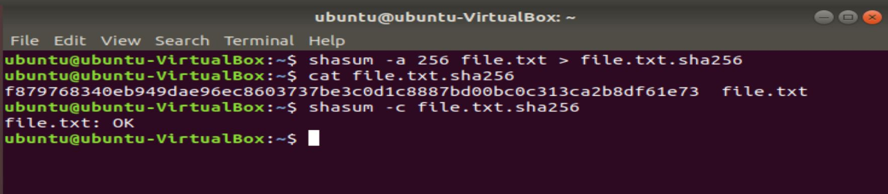

# Generate-RSA-private-and-public-key-pairs-using-the-OpenSSL-and-Hashing
This is the repository created to show encryption,decryption,hashing methods in networking security. 
In this we use OpenSSL tool to show encryption and decryption of the file and also we shall work on hashing with SHA and md5. 

## OpenSSL
OpenSSL is a commercial-grade utility toolkit for Transport Layer Security (TLS) and Secure Sockets Layer (SSL) protocols. It’s also a general-purpose cryptography library. OpenSSL is licensed under an Apache-style license, which means that you’re free to get it and use it for commercial and non-commercial purposes (subject to some simple license conditions).

##### 1.Generating a private key 
A 2048-bit RSA private key, and take a look at it. To generate the key, enter this command into the terminal: 
 
 
The contents of the private key file should look like a large jumble of random characters. 
 
 
 
##### 2.To create a public key based on a private key, enter the command below 
 The public key in the same way that you viewed the private key. It should look like a bunch of random characters, like the private key 
 
 
##### 3.Encryption 
We shall create a file secret.txt that consists the content to be encrypted and shall store in secret.enc
 
 
To encrypt the file using your public key.This creates the file "secret.enc", which is an encrypted version of "secret.txt".The encrypted file will now be ready to send to whoever holds the matching private key. 
 
##### 4.Decryption 
We must use the private key to decrypt the message, since it was encrypted using the public key.To decrypt the file, this will print the contents of the decrypted file to the screen, which should match the contents of "secret.txt":
 

## Hashing

We shall verify for two hashing programs named MD5 and SHA (SHA1 and SHA256). 
 

Md5sum is a hashing program that calculates and verifies 128-bit MD5 hashes. As with all hashing algorithms, theoretically, there's an unlimited number of files that will have any given MD5 hash. Md5sum is used to verify the integrity of files. 
 
Similarly, shasum is an encryption program that calculates and verifies SHA hashes. It's also commonly used to verify the integrity of files. 

### MD5

##### 1.Creating a text file containing some data creates a text file called "file.txt" with a single line of basic text in it. 
* Generate the MD5 sum for the file and store it 
* To print then content of the hashed data  
 
 

##### 2.Verifying a valid file 
* We can also verify that the hash is correct, and that the original file hasn't been tampered with since the sum was made. 
 
 

##### 3.Verifying an invalid file  
* The security of this process by showing how even a single-character change to the file results in a different hash. 
* Create a copy of the text file, and insert a single space at the end of the file.  
* Then generate a new md5sum for the new file.  
* The resulting hash is identical to the hash for our original file.txt despite the filenames being different. This is because hashing only looks at the data, not the metadata of the file.  
* The data has been modified in the bad_file.txt . 
* To see how different the hash of the edited file is, generate a new hash. 
* For reference,the contents of the original sum were 
 
 

### SHA1

The same steps, but for SHA1 and SHA256 hashes using the shasum tool. 
SHA256 is more seccure than SHA1 . 

##### 1.To create the SHA1 sum and save it to a file and then the file is verified. 
 
 

### SHA256 

Same tool can be used to create a SHA256 sum. 

##### 1.To create the SHA256sum  
*The "-a" flag specifies the algorithm to use, and defaults to SHA1 if nothing is specified.*  
* SHA256's increased security comes from it creating a longer hash that's harder to guess.  
* The contents of the file here are much longer than the SHA1 file . 
 
 

